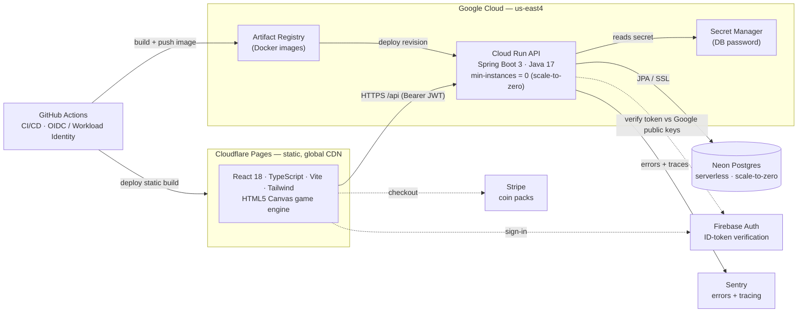
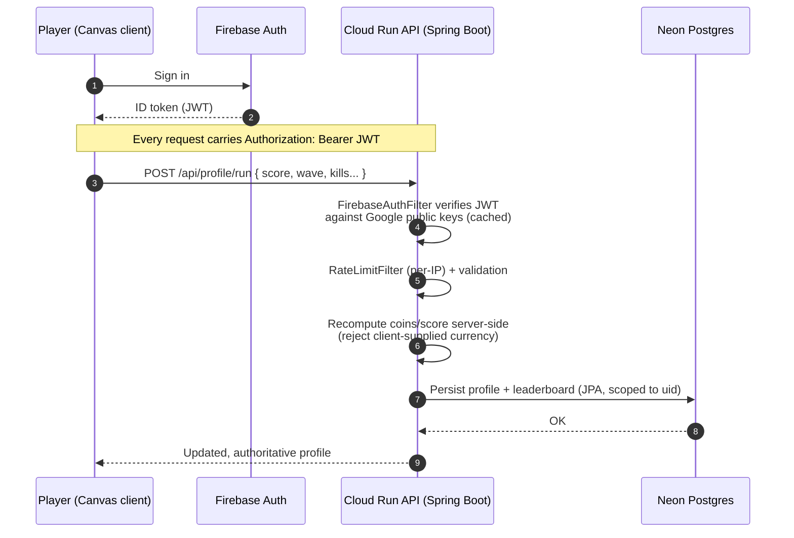
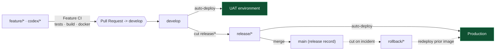

<div align="center">

# 🧟 Last Words Game

### An arcade typing-survival game with a production-grade, scale-to-zero cloud backend.

Type or speak to fire volleys. Fight zombies in Dead Keys, or switch to family-friendly Meteor Mania to zap meteors and save the planet.

<br/>


</div>

---

## Table of contents

- [Why this project is worth a look](#why-this-project-is-worth-a-look)
  - [Tech stack](#tech-stack)
  - [Services & why each was chosen](#services--why-each-was-chosen)
- [Gameplay at a glance](#gameplay-at-a-glance)
- [System architecture](#system-architecture)
- [How a run is saved](#how-a-run-is-saved)
- [CI/CD & environments](#cicd--environments)
- [Engineering highlights & design choices](#engineering-highlights--design-choices)
- [Run it locally](#run-it-locally)
- [Testing](#testing)
- [Further reading](#further-reading)

---

## Why this project is worth a look

A complete, deployed full-stack product, not a tutorial exercise. These are the pieces most worth a look:

| | |
| --- | --- |
| **Server-authoritative anti-cheat** | Scores, coins, and purchases are recomputed and authorized on the backend against the verified user. The client can never grant itself currency or items. |
| **Keyless, multi-environment CI/CD** | GitHub Actions deploys to Google Cloud via Workload Identity Federation (OIDC), so no service-account keys live in the repo. GitFlow pipelines run `feature → develop → UAT` and `release → prod`, with test gates and a release-branch validator. |
| **Stateless authentication** | Firebase ID tokens are verified against Google's public keys. There is no auth secret or session store on the server, so the API scales horizontally without shared state. |
| **Scale-to-zero architecture** | The API (Cloud Run), database (Neon), and client (Cloudflare) all idle to roughly $0, with a hard cost ceiling set by `max-instances`. |
| **Tested, with CI gates** | Vitest (client) and JUnit plus a full Spring context-load test (server) must pass before any deploy, so wiring and logic regressions fail CI instead of production. |
| **Production observability** | Sentry error and performance tracing plus structured Cloud Logging — real visibility into a running system, not `println` debugging. |
| **Decoupled, unit-tested engine** | A deterministic, seeded TypeScript game engine drives spawning, waves, scoring, and power-ups with no React dependency, and renders to a plain `<canvas>`. |
| **Family-friendly Meteor Mania mode** | A content-safe space variant swaps maps, labels, cosmetics, expressions, enemy art, SFX copy, and zapper visuals without forking the core game loop. |
| **Multi-input gameplay** | Typing, riddles, math, trivia, and mobile voice answers share the same balancing model, so desktop and touch players can compete on the same boards. |
| **Production hygiene** | Per-IP rate limiting and security headers run ahead of auth; secrets live in GCP Secret Manager and CI, never in the repo. |
| **Polished client** | Path-based SPA routing, route-level code-splitting, fully offline guest play with later sign-in import, code-drawn cosmetics, and a scaffolded Stripe checkout. |

### Tech stack

| Layer | Technology |
| --- | --- |
| Client | React 18 · TypeScript 5 · Vite 5 · Tailwind CSS 3 · HTML5 Canvas · Web Speech API · Firebase Web SDK · @sentry/react · Vitest |
| Backend | Java 17 · Spring Boot 3.2 (Web, Data JPA) · Maven · JUnit 5 |
| Data | Neon (serverless Postgres) in prod · H2 locally · localStorage guest/offline profile |
| Auth | Firebase Authentication · Firebase ID-token verification (Nimbus JOSE + JWT) |
| Hosting | Cloud Run (API) · Cloudflare Pages (static client + SPA fallback) |
| CI/CD | GitHub Actions · Workload Identity Federation (OIDC) · Artifact Registry · Docker · release branch validation |
| Ops | Sentry (React + Spring Boot + Logback/source context) · Google Cloud Logging · Secret Manager |
| Payments | Stripe hosted checkout (coin packs) |

### Services & why each was chosen

| Service | Role | Why |
| --- | --- | --- |
| Cloudflare Pages | Hosts and caches the static client | Free global CDN, and the client is a pure static build |
| Google Cloud Run | Runs the Spring Boot API container | Scale-to-zero (`min-instances=0`), pay-per-request, no servers to manage |
| Neon Postgres | Profiles, economy, leaderboards | Serverless Postgres that idles to zero — real SQL without an always-on bill |
| Firebase Auth | Identity only | Managed sign-in and verifiable ID tokens, keeping the backend stateless and secret-free |
| Artifact Registry | Stores Docker images | Native GCP registry that Cloud Run deploys from directly |
| Secret Manager | Holds the database password | Keeps secrets out of source and env files; injected at runtime |
| Sentry | Error and performance monitoring | Visibility into exceptions and traces across client and server |
| Stripe | Coin-pack purchases | Standard, secure hosted checkout for real-money currency |
| GitHub Actions | CI/CD | Tight repo integration, and OIDC federation removes static cloud keys |

---

## Gameplay at a glance

- Two core modes: Survival (endless escalating waves) and Boss Rush (a boss gauntlet), with Meteor Mania labels for Planet Defense and Comet Storm.
- Four play styles: Typing Defense, Riddle Defense, Math Defense, and Trivia Defense. Volley sizes are tuned so each style clears about the same threats per minute, so you can play whichever you enjoy.
- Three difficulty curves (Easy / Normal / Nightmare), with Meteor Mania renaming the hardest curve to Meteor Mayhem while keeping the same 2x risk/reward.
- Family-friendly mode swaps in planets, meteors, zapper visuals, space-themed maps/cosmetics, and safer copy without splitting player progression.
- On touch devices the game switches to a hold-to-speak voice-answer flow with tappable power-ups, so there is no on-screen keyboard to fight.
- Earn coins per run and spend them on consumable power-ups (grenade, freeze, med-kit), temporary upgrades, and code-drawn cosmetics up to an exclusive mythic tier. Coin packs are available via Stripe.
- Separate Top Typers and Top Solvers leaderboards.

---

## System architecture

<!-- ARCHITECTURE: keep this section, the diagrams, and the tech-stack/services tables
     current whenever the stack, infra, CI/CD, or integrations change. -->

A static React client on Cloudflare's edge talks to a Spring Boot API on Cloud Run, backed by serverless Postgres. Stateless auth, keyless CI/CD, and pay-per-use infrastructure keep idle cost near zero.



The Spring Boot service is the only application backend — it owns all data, logic, and the economy. Firebase is used only for authentication (proving who the player is); it is never the app's data or logic store.

---

## How a run is saved

The client renders and plays the game but is never trusted with the economy. Every score, coin, and purchase is recomputed and authorized on the server against the player's verified identity.



Guests are not locked out: they play fully offline against `localStorage` and can sign in later to import their progress through a validated bootstrap endpoint.

---

## CI/CD & environments

Keyless, multi-stage GitFlow pipelines on GitHub Actions. Each environment is its own Cloud Run service and Neon database, with config injected per-environment (env vars + Secret Manager), so nothing environment-specific is hardcoded.



- Required test gates: the client (Vitest) and server (JUnit + Spring Boot) suites must pass before any deploy, and a Docker build job proves the image is shippable.
- Branch-base validator: a workflow enforces that `release/*` branches are cut from `develop`, which prevents accidental prod releases off stale code.
- OIDC / Workload Identity Federation: Actions exchanges a short-lived GitHub token for GCP access at deploy time, so no service-account keys ever live in the repo or secrets.

---

## Engineering highlights & design choices

Collapsed by default — click a section to expand it.

<details>
<summary><b>Backend &amp; platform</b></summary>

- **Server-authoritative economy (anti-cheat):** purchases, rewards, and run results are validated and applied on the backend; per-account data is scoped to the verified Firebase `uid`. Server-side catalogs (upgrades, power-ups, maps, cosmetics, coin packs) are the single source of truth for prices and effects.
- **Stateless auth, no secrets:** Firebase ID tokens are verified against Google's rotating public keys (Nimbus JOSE + JWT) — no auth secret on the server, no session store, trivially horizontally scalable.
- **Production hygiene:** per-IP rate limiting, security headers, structured access logging, Sentry error and performance monitoring, secrets in Secret Manager, and a full Spring context-load test so bean-wiring regressions fail CI instead of prod.
- **Portable persistence:** Spring Data JPA over Neon Postgres in the cloud and H2 locally — the same code path, with no local cloud dependencies needed to start.

</details>

<details>
<summary><b>Client &amp; game engine</b></summary>

- **Framework-agnostic engine:** a deterministic, seeded TypeScript engine drives spawning, waves, typing and solving, scoring, and power-ups. It has no React dependency, which makes it unit-testable in isolation and renderable to a plain `<canvas>`.
- **Adaptive mobile UX:** a capability probe swaps the desktop typing loop for a hold-to-speak voice experience with tappable power-ups, and the store collapses into a tabbed, single-screen layout on small viewports.
- **Code-drawn cosmetics:** outfits and characters are drawn in SVG (shop and closet) and on canvas (gameplay) — no image assets, including animated and rarity-tiered "Exclusive Mythic" skins.
- **Resilient by default:** guests play fully offline via `localStorage`; a backend-offline banner degrades gracefully; the client does no API polling while idle, keeping the scale-to-zero backend asleep.

</details>

<details>
<summary><b>Cost engineering</b></summary>

- Cloud Run and Neon both scale to zero, and the static client is served free from Cloudflare's CDN.
- Hard cost ceilings via `max-instances`, plus a documented [cost-efficiency audit](docs/COST_EFFICIENCY_AUDIT.md).

</details>

---

## Run it locally

Two terminals — start the **server first** (the client proxies `/api` and `/health` to it).

```bash
# 1) Server — Java 17+ required (no Maven install needed; uses the wrapper)
cd server
./mvnw spring-boot:run            # serves the API on http://localhost:4100

# 2) Client
cd client
npm install                       # first time only
npm run dev                       # http://localhost:5180
```

If the server is not running, the client shows a "Backend offline" banner and still plays — progress just won't save (guest/offline mode).

---

## Testing

```bash
# Client — engine + UI unit tests (Vitest)
cd client && npm test

# Server — JUnit 5 + Spring Boot tests (incl. full context-load)
cd server && ./mvnw test
```

Both suites run as required gates in CI before every deploy.

---

## Further reading

- [`docs/COST_EFFICIENCY_AUDIT.md`](docs/COST_EFFICIENCY_AUDIT.md) — how idle cost is driven to near-zero
