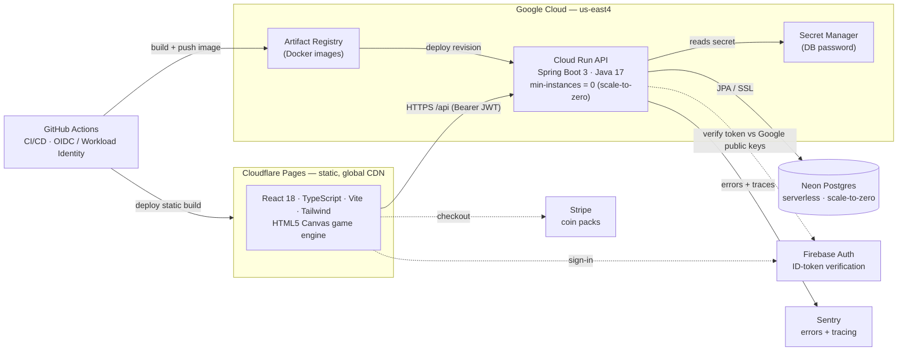
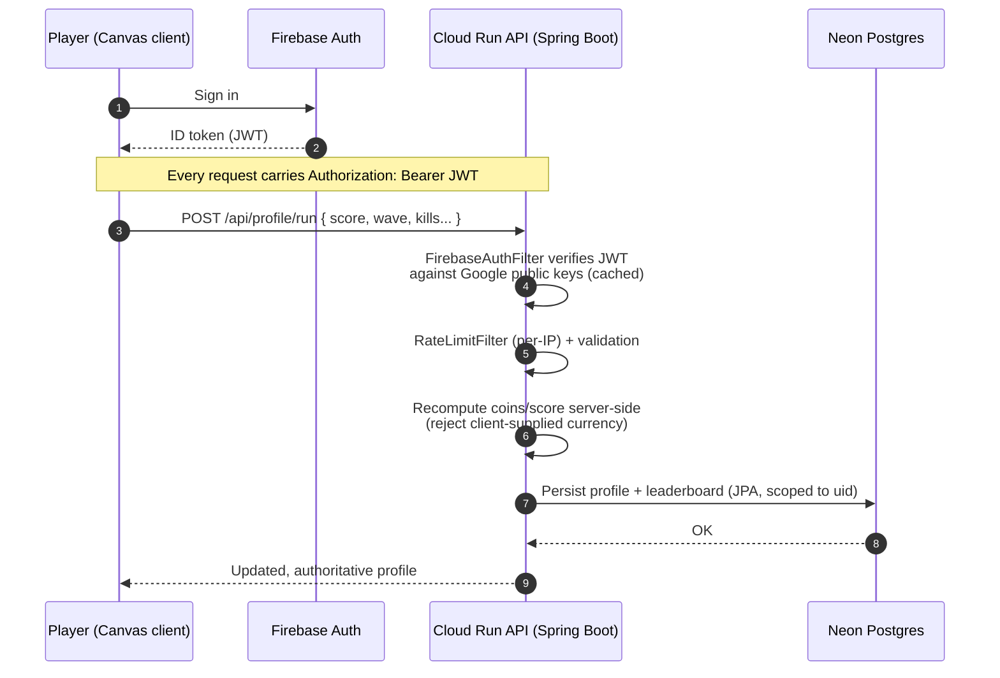
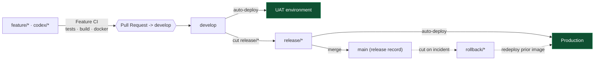

<div align="center">

# 🧟 Dead Keys

### An arcade **typing-survival** game with a production-grade, scale-to-zero cloud backend.

*Type to shoot. Solve riddles, math, and trivia to fire volleys. Outlast the horde — on desktop or by voice on mobile.*

<br/>


</div>

---

## 📖 Table of contents

- [Why this project is worth a look](#-why-this-project-is-worth-a-look)
- [Gameplay at a glance](#-gameplay-at-a-glance)
- [System architecture](#-system-architecture)
- [How a run is saved (server-authoritative anti-cheat)](#-how-a-run-is-saved-server-authoritative-anti-cheat)
- [CI/CD & environments](#-cicd--environments)
- [Engineering highlights & design choices](#-engineering-highlights--design-choices)
- [Tech stack](#-tech-stack)
- [Services & why each was chosen](#-services--why-each-was-chosen)
- [Repository layout](#-repository-layout)
- [Run it locally](#-run-it-locally)
- [Testing](#-testing)
- [Further reading](#-further-reading)

---

## 🎯 Why this project is worth a look

> A complete, full-stack product — not a tutorial clone — built to **run in production for near-zero idle cost** while still demonstrating the patterns reviewers care about: stateless auth, a server-authoritative economy, keyless CI/CD, production observability, automated test gates, and a cleanly decoupled, unit-tested game engine.

| | |
| --- | --- |
| 🧊 **Scale-to-zero everywhere** | API (Cloud Run), database (Neon), and static client (Cloudflare) all idle to **$0**. Hard cost ceilings via `max-instances`. |
| 🔐 **Stateless auth** | The backend verifies **Firebase ID tokens against Google's public keys** — no auth secrets on the server, no session store. |
| 🛡️ **Anti-cheat by design** | Coins, purchases, rewards, and run results are validated and applied **on the server**; the client can never grant itself currency or items. |
| 🔑 **Keyless deploys** | GitHub Actions authenticates to GCP via **Workload Identity Federation (OIDC)** — zero long-lived service-account keys in the repo. |
| 📈 **Error monitoring & tracing** | **Sentry** captures backend exceptions and performance traces (environment-gated DSN), with structured access logs in **Google Cloud Logging** — real production visibility, not `println` debugging. |
| 🔁 **Multi-environment CD** | Automated **GitFlow** pipelines (`feature → develop → UAT`, `release → prod`) with deploy smoke tests and a release-branch-base validator that blocks malformed releases. |
| ✅ **Tested & CI-gated** | **Vitest** (client engine + UI) and **JUnit + a full Spring context-load test** (server) run as required gates before every deploy, so bean-wiring and logic regressions fail CI, not prod. |
| 🚦 **Abuse protection** | Per-IP, memory-bounded **rate limiting** and security headers run ahead of auth — CDN/WAF-ready for real traffic. |
| 🔒 **Secrets hygiene** | Database password and API tokens live in **GCP Secret Manager** / CI secrets and are injected at runtime — nothing sensitive is committed. |
| ⚡ **Fast, resilient client** | Route-level **code-splitting** keeps the game engine out of the initial load; guests play **fully offline** (localStorage) and import progress after signing in. |
| 💳 **Payments-ready** | **Stripe** hosted checkout is scaffolded for real-money coin packs. |
| 🎮 **Framework-agnostic engine** | A deterministic, **seeded** TypeScript game engine (spawning, waves, scoring, power-ups) rendered to `<canvas>`, fully decoupled from React and unit-tested. |
| 🎨 **Zero image assets** | Every character, outfit, and rarity-tiered "Exclusive Mythic" skin is **drawn in code** (SVG + canvas). Nothing to host, nothing to cache-bust. |

---

## 🕹 Gameplay at a glance

- **Two modes** — *Survival* (endless escalating waves) and *Boss Rush* (a boss gauntlet).
- **Four play styles** — ⌨ **Typing**, 🧩 **Riddle**, ➗ **Math**, and 🧠 **Trivia** Defense. Volley sizes are tuned so every style clears about the same zombies-per-minute, so you can pick what you enjoy.
- **Three difficulties** — Easy / Normal / Nightmare, with score & coin multipliers that scale with risk.
- **📱 Mobile speech experience** — on touch devices the game switches to a **hold-to-speak** voice-answer flow with tappable power-ups, so there's no on-screen keyboard fight.
- **Economy & cosmetics** — earn coins per run, spend them on consumable power-ups (🧨 grenade, ❄️ freeze, 🩹 med-kit), temporary upgrades, and code-drawn cosmetics up to an exclusive mythic tier. Optional **Stripe** coin packs.
- **Global leaderboards** — separate *Top Typers* and *Top Solvers* boards.

---

## 🏗️ System architecture

<!-- ARCHITECTURE: keep this section, the diagrams, and the tech-stack/services tables
     current whenever the stack, infra, CI/CD, or integrations change. -->

A serverless, **scale-to-zero** full-stack app: a static React client on Cloudflare's edge talks to a Spring Boot API on Cloud Run, backed by serverless Postgres. Stateless auth, keyless CI/CD, and pay-per-use infra keep idle cost near zero.



**Module boundary:** the **Spring Boot service is the one and only application backend** — it owns all data, logic, and the economy. **Firebase is used *only* for authentication** (proving *who* the player is); it is never the app's data or logic store.

---

## 🔄 How a run is saved (server-authoritative anti-cheat)

The client renders and plays the game, but it is **never trusted** with the economy. Every score, coin, and purchase is recomputed and authorized on the server against the player's verified identity.



Guests aren't locked out: they play **fully offline** against `localStorage`, and can later sign in to import their progress through a dedicated, validated bootstrap endpoint.

---

## 🚀 CI/CD & environments

Keyless, multi-stage **GitFlow** pipelines on GitHub Actions. Each environment is its own Cloud Run service + Neon database, with config injected per-environment (env vars + Secret Manager) — nothing environment-specific is hardcoded.



- **Required test gates** — client (Vitest) and server (JUnit + Spring Boot) suites must pass before any deploy. A Docker build job proves the image is shippable.
- **Branch-base validator** — a workflow enforces that `release/*` branches are cut from `develop`, preventing accidental prod releases off stale code.
- **OIDC / Workload Identity Federation** — Actions exchanges a short-lived GitHub token for GCP access at deploy time. No service-account JSON keys ever live in the repo or secrets.

---

## 💡 Engineering highlights & design choices

<details open>
<summary><b>Backend &amp; platform</b></summary>

- **Server-authoritative economy (anti-cheat):** purchases, rewards, and run results are validated and applied on the backend; per-account data is scoped to the verified Firebase `uid`. Server-side **catalogs** (upgrades, power-ups, maps, cosmetics, coin packs) are the single source of truth for prices and effects.
- **Stateless auth, no secrets:** Firebase ID tokens are verified against Google's rotating public keys (Nimbus JOSE + JWT) — no auth secret on the server, no session store, trivially horizontally scalable.
- **Production hygiene:** per-IP **rate limiting**, security headers, structured access logging, Sentry error + performance monitoring, secrets in **Secret Manager**, and a full **Spring context-load test** so bean-wiring regressions fail CI instead of prod.
- **Portable persistence:** Spring Data JPA over **Neon Postgres** in the cloud and **H2** locally — same code path, zero local cloud dependencies to start hacking.

</details>

<details open>
<summary><b>Client &amp; game engine</b></summary>

- **Framework-agnostic engine:** a deterministic, **seeded** TypeScript engine drives spawning, waves, typing/solving, scoring, and power-ups. It has no React dependency, which makes it **unit-testable in isolation** and re-renderable to a plain `<canvas>`.
- **Adaptive mobile UX:** a capability probe swaps the desktop typing loop for a **hold-to-speak** voice experience with tappable power-ups, and the store collapses into a tabbed, single-screen layout on small viewports.
- **Code-drawn cosmetics:** outfits and characters are drawn in SVG (shop/closet) and on canvas (gameplay) — **no image assets**, including animated and rarity-tiered "Exclusive Mythic" skins.
- **Resilient by default:** guests play fully offline via `localStorage`; a backend-offline banner degrades gracefully; the client does **no API polling while idle**, keeping the scale-to-zero backend asleep.

</details>

<details open>
<summary><b>Cost engineering</b></summary>

- Cloud Run and Neon both scale to zero; the static client is served free from Cloudflare's CDN.
- Hard cost ceilings via `max-instances`, plus a documented [cost-efficiency audit](docs/COST_EFFICIENCY_AUDIT.md) and a [reusable-accounts &amp; cost playbook](docs/REUSABLE_ACCOUNTS_AND_COST_PLAYBOOK.md).

</details>

---

## 🧰 Tech stack

| Layer | Technology |
| --- | --- |
| **Client** | React 18 · TypeScript 5 · Vite 5 · Tailwind CSS 3 · HTML5 Canvas · Vitest |
| **Backend** | Java 17 · Spring Boot 3 (Web, Data JPA) · Maven · JUnit 5 |
| **Data** | Neon (serverless Postgres) — prod · H2 — local dev |
| **Auth** | Firebase Authentication (ID-token verification, Nimbus JOSE + JWT) |
| **Hosting** | Cloud Run (API) · Cloudflare Pages (client) |
| **CI/CD** | GitHub Actions · Workload Identity Federation (OIDC) · Artifact Registry · Docker |
| **Ops** | Sentry · Google Cloud Logging · Secret Manager |
| **Payments** | Stripe (coin packs) |

---

## 🔌 Services & why each was chosen

| Service | Role in the system | Why it was chosen |
| --- | --- | --- |
| **Cloudflare Pages** | Hosts &amp; globally caches the static client | Free, fast global CDN; the client is a pure static build |
| **Google Cloud Run** | Runs the Spring Boot API as a container | **Scale-to-zero** (`min-instances=0`), pay-per-request, autoscaling without managing servers |
| **Neon Postgres** | Player profiles, economy, leaderboards | Serverless Postgres that **idles to zero**; real SQL without an always-on DB bill |
| **Firebase Auth** | Identity provider only | Managed sign-in + verifiable ID tokens, so the backend stays **stateless and secret-free** |
| **Artifact Registry** | Stores deployable Docker images | Native GCP registry that Cloud Run deploys from directly |
| **Secret Manager** | Holds the database password | Keeps secrets out of source and env files; injected at runtime |
| **Sentry** | Error &amp; performance monitoring | Production visibility into exceptions and traces across client + server |
| **Stripe** | Coin-pack purchases | Industry-standard, secure hosted checkout for real-money currency |
| **GitHub Actions** | CI/CD orchestration | Tight repo integration; **OIDC** federation removes static cloud keys |

---

## 🗂 Repository layout

```
dead-keys/
├─ client/                 # React + TypeScript + Vite game (dev server :5180)
│  └─ src/
│     ├─ game/             # Framework-agnostic, seeded engine + Vitest tests
│     ├─ components/       # Menu, store, game screen, leaderboard, HUD...
│     ├─ mobile/           # Capability detection + speech-answer experience
│     ├─ data/             # Client-side catalogs (words, puzzles, cosmetics...)
│     └─ lib/              # API client, auth, audio
├─ server/                 # Spring Boot (Java 17) REST API (HTTP :4100)
│  └─ src/main/java/com/deadkeys/
│     ├─ controller/       # REST endpoints (/api/profile, /api/leaderboard...)
│     ├─ service/          # Server-authoritative profile & economy logic
│     ├─ security/         # Firebase auth, per-IP rate limiting, request logging
│     ├─ catalog/          # Source-of-truth prices/effects (upgrades, power-ups...)
│     └─ persistence/      # JPA entities & repositories
├─ docs/                   # Cost audit, mobile guide, cost/accounts playbook
└─ .github/workflows/      # Feature CI, UAT/prod deploys, branch-base validator
```

---

## ▶️ Run it locally

Two terminals — start the **server first** (the client proxies `/api` and `/health` to it).

```bash
# 1) Server — Java 17+ required (no Maven install needed; uses the wrapper)
cd server
./mvnw spring-boot:run            # serves the API on http://localhost:4100

# 2) Client
cd client
npm install                       # first time only
npm run dev                       # http://localhost:5180
```

If the server isn't running, the client shows a **"Backend offline"** banner and still plays — progress just won't save (guest/offline mode).

---

## ✅ Testing

```bash
# Client — engine + UI unit tests (Vitest)
cd client && npm test

# Server — JUnit 5 + Spring Boot tests (incl. full context-load)
cd server && ./mvnw test
```

Both suites run as **required gates** in CI before every deploy.

---

## 📚 Further reading

- [`docs/COST_EFFICIENCY_AUDIT.md`](docs/COST_EFFICIENCY_AUDIT.md) — how idle cost is driven to near-zero
- [`docs/REUSABLE_ACCOUNTS_AND_COST_PLAYBOOK.md`](docs/REUSABLE_ACCOUNTS_AND_COST_PLAYBOOK.md) — reusable account &amp; cost patterns
- [`docs/MOBILE_IMPLEMENTATION_GUIDE.md`](docs/MOBILE_IMPLEMENTATION_GUIDE.md) — the mobile speech experience
- [`client/README.md`](client/README.md) · [`server/README.md`](server/README.md) — module-level details

<div align="center">

<br/>

*Built as an end-to-end demonstration of full-stack engineering, cloud architecture, and cost-conscious system design.*

</div>
