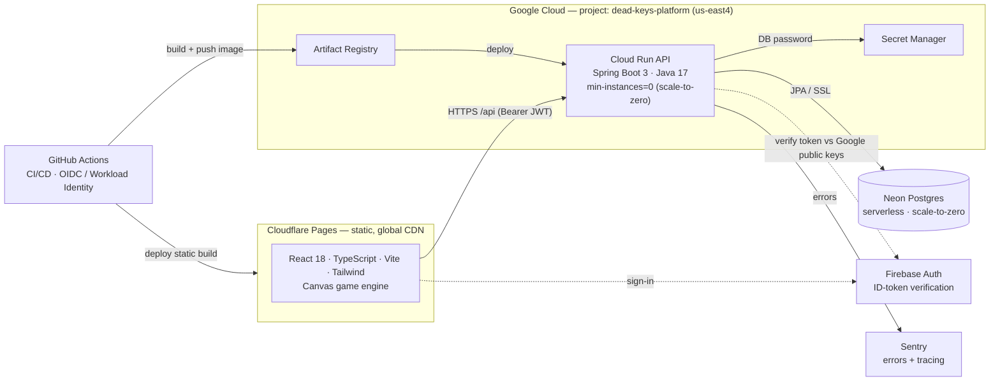

# Dead Keys

An arcade typing-survival game, split into two modules:

```
zombie-text-rush/
  client/   React + TypeScript + Vite game client   (dev server :5180)
  server/   Spring Boot (Java) backend / REST API    (HTTP :4100)
```

The **client** is the game; the **server** owns player progress (stats, coins,
upgrades) and the global leaderboard, persisted to a JSON file.

> **Backend is always Java.** The Spring Boot service in `server/` is the one and
> only application backend. Firebase is used *only* for authentication (verifying
> who the player is) — it is never the app's data/logic backend.

<!-- ARCHITECTURE: keep this section, the diagram, and the tech-stack table current
     whenever the stack, infra, CI/CD, or integrations change. -->

## Architecture

A serverless, **scale-to-zero** full-stack app: a static React client on
Cloudflare's edge talking to a Spring Boot API on Cloud Run, backed by serverless
Postgres. Stateless auth, keyless CI/CD, and pay-per-use infra keep idle cost
near zero.



**Environments & flow:** `feature/*` → **`develop`** (auto-deploys **UAT**) →
cut **`release/*`** (auto-deploys **prod**) → merge to `main` (release record).
A `rollback/*` branch (cut from `main`) covers prod rollbacks. Each environment
is its own Cloud Run service + Neon database; config is injected per-environment
(env vars + Secret Manager), so nothing environment-specific is hardcoded.

## Highlights (system design)

- **Serverless & cost-efficient:** Cloud Run and Neon both scale to zero; static
  client served free from Cloudflare's CDN. Hard cost ceilings (`max-instances`),
  a documented [cost-efficiency audit](docs/COST_EFFICIENCY_AUDIT.md) and
  [reuse/cost playbook](docs/REUSABLE_ACCOUNTS_AND_COST_PLAYBOOK.md).
- **Keyless CI/CD:** GitHub Actions authenticates to GCP via **Workload Identity
  Federation (OIDC)** — no long-lived service-account keys. Multi-stage GitFlow
  pipelines with test gates, deploy smoke tests, and a branch-base validator that
  enforces releases are cut from `develop`.
- **Server-authoritative game economy (anti-cheat):** purchases, rewards, and run
  results are validated and applied on the backend; the client can't grant itself
  coins or items. Per-account data is scoped to the verified Firebase uid.
- **Stateless auth:** the API verifies Firebase **ID tokens against Google's
  public keys** — no auth secrets on the server, no session store.
- **Framework-agnostic game engine:** a deterministic, seeded TypeScript engine
  (spawning, waves, typing, scoring, power-ups) rendered on `<canvas>`, decoupled
  from React and unit-tested.
- **Code-drawn cosmetics:** outfits/characters are drawn in SVG (shop/closet) and
  canvas (gameplay) — **zero image assets**, including animated and rarity-tiered
  "Exclusive Mythic" character skins.
- **Resilient client:** guests play fully offline (localStorage); a backend-offline
  banner degrades gracefully; no API polling while idle.
- **Production hygiene:** per-IP rate limiting, security headers, Sentry error
  monitoring, structured access logs, secrets in Secret Manager, and a full
  Spring context-load test so bean-wiring regressions fail CI, not prod.
- **Tested:** Vitest (client engine/UI) and JUnit + Spring Boot tests (server),
  run as required gates before every deploy.

## Tech stack

| Layer | Tech |
| --- | --- |
| Client | React 18, TypeScript, Vite, Tailwind CSS, HTML5 Canvas, Vitest |
| Backend | Java 17, Spring Boot 3 (Web, Data JPA), Maven, JUnit 5 |
| Data | Neon (serverless Postgres) prod · H2 (file) dev |
| Auth | Firebase Authentication (ID-token verification) |
| Hosting | Cloud Run (API) · Cloudflare Pages (client) |
| CI/CD | GitHub Actions, Workload Identity Federation, Artifact Registry, Docker |
| Ops | Sentry, Cloud Logging, GCP Secret Manager |
| Payments | Stripe (coin packs — scaffolded) |

## Run it (two terminals)

```bash
# 1) server — Java 17+ required, no Maven install needed
cd server
java -jar target/server-1.0.0.jar      # or: ./mvnw spring-boot:run

# 2) client
cd client
npm install      # first time only
npm run dev      # http://localhost:5180
```

The client's Vite dev server proxies `/api` and `/health` to the server on
`:4100`, so start the server first (or the game shows a "Backend offline" banner
and runs without saving progress).

For remaining accounts, credentials, dashboard settings, and unfinished
integrations, see [`REMAINING_SETUP.md`](REMAINING_SETUP.md).

For the recommended low-cost system design, API gateway decision, module
boundaries, and future microservice criteria, see
[`SYSTEM_ARCHITECTURE_ROADMAP.md`](SYSTEM_ARCHITECTURE_ROADMAP.md).

See `client/README.md` and `server/README.md` for module details.
